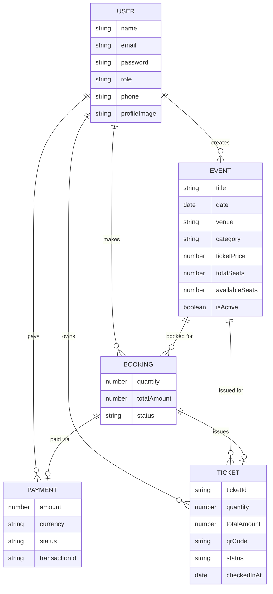

# ER Diagram

Text-based (Mermaid) diagram in place of a static `ER-Diagram.png` — GitHub
renders this natively, and it stays in sync with `collections.md` more
easily than a binary image would.

```mermaid
erDiagram
    USER ||--o{ EVENT : creates
    USER ||--o{ BOOKING : makes
    USER ||--o{ TICKET : owns
    USER ||--o{ PAYMENT : pays
    EVENT ||--o{ BOOKING : "booked for"
    EVENT ||--o{ TICKET : "issued for"
    BOOKING ||--o| PAYMENT : "paid via"
    BOOKING ||--o| TICKET : "issues"

    USER {
        string name
        string email
        string password
        string role
        string phone
        string profileImage
    }
    EVENT {
        string title
        date date
        string venue
        string category
        number ticketPrice
        number totalSeats
        number availableSeats
        boolean isActive
    }
    BOOKING {
        number quantity
        number totalAmount
        string status
    }
    PAYMENT {
        number amount
        string currency
        string status
        string transactionId
    }
    TICKET {
        string ticketId
        number quantity
        number totalAmount
        string qrCode
        string status
        date checkedInAt
    }
```
